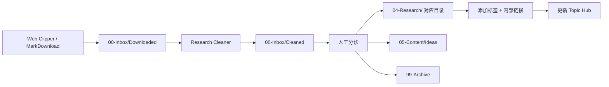

# Research Collection Workflow

> Inbox 收集 - 清洗 - 归类的完整工作流

## 每日流程

1. 打开 `00-Inbox/Downloaded/` 查看新收集的内容
2. 运行 Research Cleaner 清洗（如已配置）
3. 按照 Triage Guide 人工分诊
4. 移到目标目录
5. 添加标签和内部链接
6. 清空 Inbox

## 原则

- **Inbox 不为空**：定期清理，保持 Inbox 是"待处理"状态而非存储区
- **来源必标**：每条资料必须标注来源 URL
- **先清洗后入库**：尽量清洗后再移入 Research
- **去重**：入库前检查是否已有相同内容
