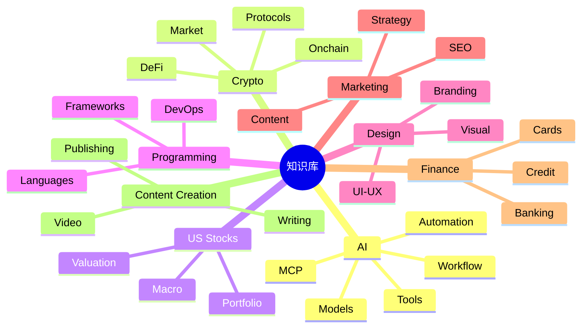

# Knowledge Map

> 知识库的全景知识地图。

## 核心领域

```mermaid
mindmap
  root((知识库))
    AI
      Models
      Workflow
      Automation
      Tools
      MCP
    Crypto
      Market
      Onchain
      Protocols
      DeFi
    US Stocks
      Portfolio
      Macro
      Valuation
    Programming
      Languages
      Frameworks
      DevOps
    Design
      UI-UX
      Visual
      Branding
    Marketing
      Strategy
      SEO
      Content
    Finance
      Banking
      Cards
      Credit
    Content Creation
      Video
      Writing
      Publishing
```

## 交叉领域

- AI + Crypto = AI x Crypto 交叉
- AI + Design = AI 辅助设计
- Finance + Crypto = 数字金融
- Marketing + Content = 内容营销
